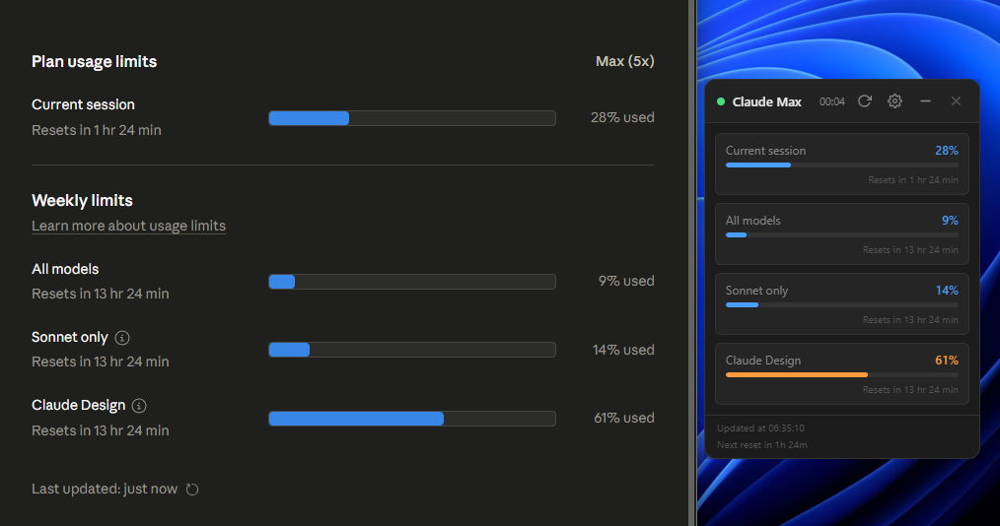
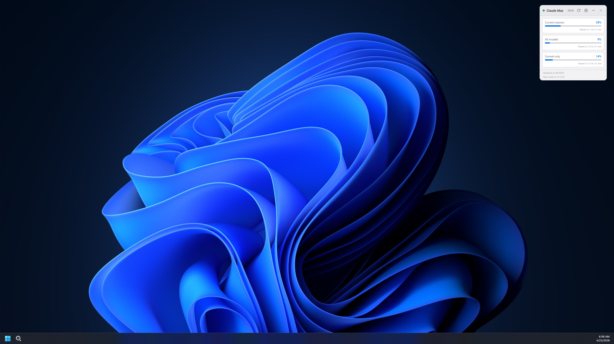
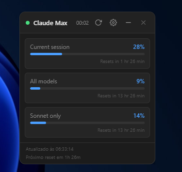
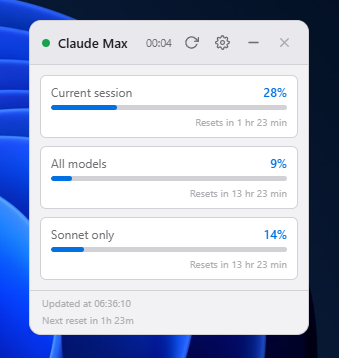
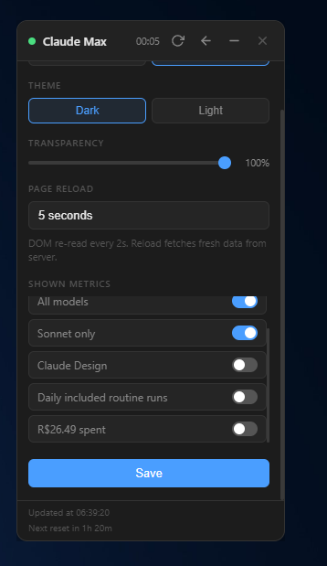
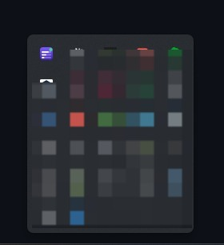

<div align="center">

# Claude Usage Monitor

**Widget flutuante de desktop para acompanhar em tempo real o uso do seu plano Claude.**

[](https://www.electronjs.org/)
[](#instalação)
[](#instalação)
[](#instalação)
[](#licença)
[](#roadmap)

[Sobre](#-sobre) • [Funcionalidades](#-funcionalidades) • [Screenshots](#-screenshots) • [Instalação](#-instalação) • [Como usar](#-como-usar) • [Arquitetura](#-arquitetura) • [Roadmap](#-roadmap)

🇺🇸 [English version](README.md)

</div>

---

## ✨ Sobre

O **Claude Usage Monitor** é um pequeno widget de desktop, sempre visível, que mostra quanto do seu plano do [Claude](https://claude.ai) você já consumiu — sem precisar abrir o navegador e entrar em *Settings → Usage* a cada hora.

Ele se conecta à sua conta Claude via uma janela de login nativa, guarda a sessão com segurança e atualiza os dados automaticamente em segundo plano.

<div align="center">
  
  <br/><sub><b>Widget espelhando a página de uso do Claude em tempo real</b></sub>
</div>

---

## 🚀 Funcionalidades

- 🪟 **Widget flutuante** — sempre no topo, sem bordas, transparente e arrastável.
- 🔄 **Atualização automática** — recarrega os dados do servidor no intervalo que você escolher (5s a 5min).
- ⚡ **DOM quase em tempo real** — re-lê os valores na tela a cada 2 segundos entre recargas.
- 🔐 **Login nativo e persistente** — autentica uma vez, mantém a sessão salva com cookies seguros.
- 🌗 **Tema claro e escuro** — combina com qualquer configuração de desktop.
- 📊 **Múltiplas métricas** — mostra todas as barras de uso disponíveis (mensagens, Opus, Sonnet, etc.).
- ⏱️ **Contagem regressiva** — saiba exatamente quando virá a próxima atualização.
- ⏳ **Countdown de reset** — rodapé mostra o tempo restante até seu plano reiniciar.
- 🎛️ **Filtros** — esconda métricas que você não quer ver.
- 📉 **Minimizar / restaurar** — encolha para uma barra fina quando quiser só espiar.
- 🖥️ **System tray** — fica discreto na bandeja do sistema; um clique mostra/oculta.
- 🌐 **Bilíngue** — interface em inglês e português (pt-BR).

---

## 📸 Screenshots

<div align="center">
  
  <br/><sub><b>Sempre no topo — funciona em qualquer lugar da área de trabalho</b></sub>
</div>

<br/>

<table>
  <tr>
    <td align="center">
      
      <br/><sub><b>Tema escuro</b></sub>
    </td>
    <td align="center">
      
      <br/><sub><b>Tema claro</b></sub>
    </td>
  </tr>
</table>

<table>
  <tr>
    <td align="center">
      
      <br/><sub><b>Configurações — tema, transparência, intervalo de recarga, filtros de métricas</b></sub>
    </td>
    <td align="center">
      
      <br/><sub><b>Ícone na bandeja do sistema</b></sub>
    </td>
  </tr>
</table>

---

## 📦 Instalação

### Opção 1 — Instalador pré-compilado

Vá até a seção [Releases](../../releases) do repositório e baixe o arquivo da sua plataforma:

| Plataforma | Arquivo | Arquitetura |
| ---------- | ------- | ----------- |
| Windows    | `Claude-Usage-Monitor-Setup-x.x.x.exe` | x64 |
| macOS      | `Claude-Usage-Monitor-x.x.x.dmg` | x64 (Intel) / arm64 (Apple Silicon) |
| Linux      | `Claude-Usage-Monitor-x.x.x.AppImage` | x64 |

> 💡 Também é possível baixar os binários gerados em cada commit na aba
> **Actions → Build → Artifacts**.

#### macOS — aviso de segurança (Gatekeeper)

O app não possui assinatura Apple (requer conta de desenvolvedor paga). Na primeira abertura, o macOS pode mostrar a mensagem *"app danificado"*. Para contornar, abra o Terminal e execute:

```bash
xattr -cr /Applications/Claude\ Usage\ Monitor.app
```

#### Linux — tornar o AppImage executável

```bash
chmod +x Claude-Usage-Monitor-*.AppImage
./Claude-Usage-Monitor-*.AppImage
```

### Opção 2 — A partir do código-fonte

```bash
# 1. Clone o repositório
git clone https://github.com/jnerytech/claude-usage-monitor.git
cd claude-usage-monitor

# 2. Instale as dependências
npm install

# 3. Rode em modo desenvolvimento
npm start

# 4. (Opcional) Gere o instalador para sua plataforma atual
npm run build
```

O instalador final é gerado em `dist/`.

---

## 🎯 Como usar

1. **Abra o app** — o widget aparece no canto inferior direito da tela.
2. **Faça login** — clique em *Sign in to Claude* e autentique com sua conta normal.
3. **Pronto!** — os dados de uso começam a aparecer em segundos.

### Controles do widget

| Ícone | Ação |
| :---: | :--- |
| ↻ | Atualizar agora (força uma nova busca). |
| ⚙ | Abrir / fechar configurações. |
| − | Minimizar para uma barra fina. |
| ✕ | Fechar o app. |

### Atalhos pela bandeja do sistema

- **Clique simples** no ícone → mostra / oculta o widget.
- **Clique direito** → menu com opções *Mostrar / Ocultar* e *Sair*.

---

## 🏗️ Arquitetura

O app é uma aplicação **Electron** simples com três janelas e um tray.

```
┌───────────────────────┐        ┌─────────────────────────┐
│   Main Window         │        │   Hidden Window         │
│   (widget flutuante)  │◀──IPC──│   (carrega claude.ai/   │
│   renderer/index.html │        │    settings/usage em    │
└───────────────────────┘        │    background)          │
           ▲                     └─────────────────────────┘
           │                                  │
           │                                  │ executeJavaScript
           │                                  ▼
┌───────────────────────┐        ┌─────────────────────────┐
│   Tray Icon           │        │   DOM extraction         │
│   (mostrar/ocultar)   │        │   (progressbars, labels) │
└───────────────────────┘        └─────────────────────────┘
```

**Estratégia de atualização** — dois timers independentes:

| Timer | Frequência | Propósito |
| ----- | ---------- | --------- |
| `reloadTimer` | configurável (5s–5min) | recarrega a página → busca dados novos do servidor |
| `extractTimer` | 2 segundos | re-lê o DOM já carregado → responsividade |

### Stack

- [Electron 41](https://www.electronjs.org/) — runtime desktop.
- [electron-store](https://github.com/sindresorhus/electron-store) — persistência de cookies e preferências.
- [electron-updater](https://www.electron.build/auto-update) — auto-update via GitHub Releases.
- [electron-builder](https://www.electron.build/) — empacotamento do instalador.
- **HTML / CSS / JS puros** no renderer — sem framework, zero bundler.

---

## 🗂️ Estrutura do projeto

```
claude-usage-monitor/
├── main.js              # processo principal Electron (janelas, tray, timers, IPC)
├── preload.js           # bridge segura entre main e renderer
├── renderer/
│   ├── index.html       # UI do widget
│   ├── style.css        # estilos (temas claro/escuro)
│   ├── locales.js       # strings i18n (en / pt-BR)
│   └── app.js           # lógica de UI e comunicação via claudeAPI
├── assets/              # ícones do app e do instalador
├── build/               # ícone 1024×1024 para builds mac/linux
├── scripts/             # utilitários de geração de ícones
└── package.json
```

---

## 🔒 Privacidade

- Os cookies de sessão ficam **apenas no seu computador**, gerenciados via `electron-store`.
- O app **não envia dados** para nenhum servidor próprio — apenas acessa `claude.ai` em seu nome.
- Você pode sair a qualquer momento (bandeja → Sair) → limpa cookies e storage local.

---

## 🛠️ CI / Release

O repositório tem um workflow [`Build`](.github/workflows/build.yml) que compila para as três plataformas em paralelo:

| Evento | O que acontece |
| ------ | -------------- |
| Push em `main` ou Pull Request | Build Windows + macOS + Linux, upload como **artifacts** (30 dias). |
| Push de tag `v*` (ex.: `v1.0.0`) | Build + criação automática de **GitHub Release** com todos os instaladores. |
| `workflow_dispatch` | Build manual pela aba Actions. |

**Arquivos gerados por plataforma:**

| Plataforma | Arquivos |
| ---------- | -------- |
| Windows    | `.exe`, `.exe.blockmap`, `latest.yml` |
| macOS      | `.dmg`, `.dmg.blockmap`, `.zip`, `latest-mac.yml` |
| Linux      | `.AppImage`, `.AppImage.blockmap`, `latest-linux.yml` |

### Publicando uma nova versão

```bash
# atualize a versão em package.json, commit, e então:
git tag v1.0.0
git push origin v1.0.0
```

### Regenerando ícones

```bash
npm run icons
```

Converte `build/icon.svg` → `build/icon.png` (1024px) e `assets/icon.ico`, e `assets/tray.svg` → `assets/tray.png` (32px).

---

## 🗺️ Roadmap

- [x] Build e release automáticos via GitHub Actions
- [x] Suporte a macOS e Linux
- [x] System tray com mostrar/ocultar
- [x] Countdown de reset por métrica
- [x] Interface bilíngue (en / pt-BR)
- [x] Ícones SVG profissionais
- [ ] Histórico de uso com gráfico (últimos 7 dias)
- [ ] Notificações quando passar de um limite (ex.: 80%)
- [ ] Atalho global configurável para mostrar/ocultar
- [ ] Posição / tamanho do widget persistidos entre sessões

---

## 🤝 Contribuindo

Contribuições, issues e sugestões são muito bem-vindas!

1. Faça um fork do projeto.
2. Crie sua branch: `git checkout -b feat/minha-feature`.
3. Commit: `git commit -m 'feat: minha feature'`.
4. Push: `git push origin feat/minha-feature`.
5. Abra um Pull Request.

---

## 📄 Licença

Distribuído sob a licença **MIT**. Veja [`LICENSE`](LICENSE) para mais detalhes.

---

<div align="center">

Feito com ☕ e muito Claude por [**@jnerytech**](https://github.com/jnerytech)

<sub>Este projeto não é afiliado à Anthropic. *Claude* é uma marca da Anthropic, PBC.</sub>

</div>
